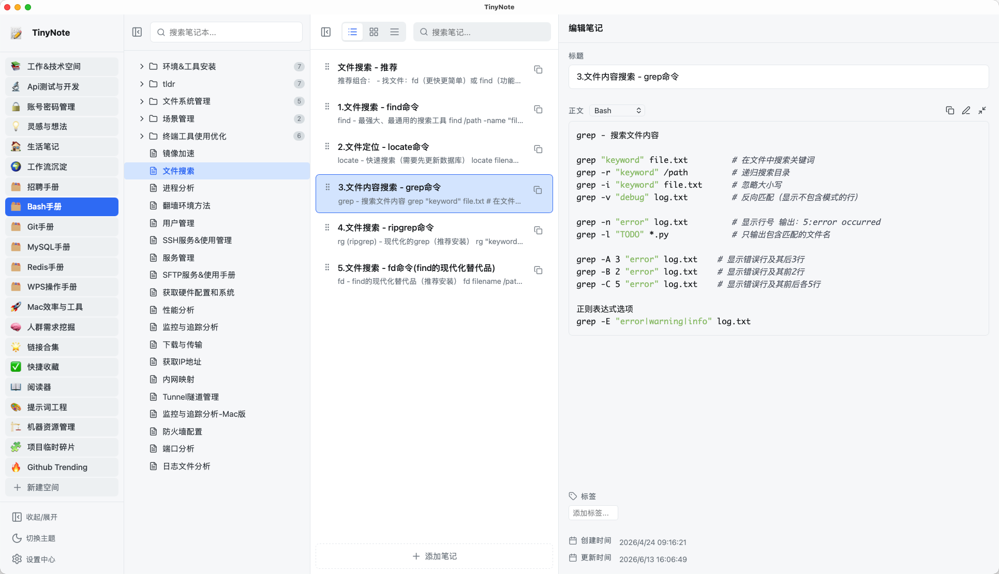

# TinyNote 轻记

## **零碎笔记，一键复制**

TinyNote 轻记是一款专为开发者与效率用户打造的笔记管理工具。把常用命令、代码片段与零碎知识整理得井井有条——需要时随手复制，告别鼠标点选和框选，开启效率办公。

## 界面预览

> 支持浅色与深色主题切换，四栏布局清晰分区：应用栏、目录栏、笔记栏与属性编辑栏。

## 为什么选择 TinyNote

| | |
|---|---|
| **5~10 MB 轻量安装** | 对比动辄上百 MB 的笔记应用，下载快、不占空间 |
| **极速启动** | 双击即开，无漫长加载，随时待命 |
| **快速检索** | 目录与笔记双搜索，海量片段中秒级定位 |
| **一键复制** | 每个笔记块独立复制按钮，无需框选，找到即复制 |
| **本地优先** | 数据存于本地 Markdown 文件，隐私可控、格式开放 |
| **Git 同步 & 本地备份** | 笔记库即 Git 仓库，亦可一键打包备份 |

## 核心功能

- **快捷复制** — 一键将笔记块内容送入剪贴板，支持复制标题、正文或完整笔记，专为 Shell 命令、JSON 配置、Prompt 模板等高频场景优化
- **无限层级组织** — 空间 → 分组 → 笔记本 → 笔记块，四层结构映射真实目录，支持无限嵌套
- **三种视图** — 列表、卡片、紧凑三种视图随心切换
- **拖拽排序** — 笔记块、空间、分组与笔记本均支持拖拽重排
- **Markdown 源码模式** — 笔记以 Markdown 存储，可直接编辑源码，亦可用任意编辑器或 Git 打开
- **标签与属性编辑** — 标题、正文、标签与创建/更新时间一目了然

## 适用场景

TinyNote 专注「零碎片段的高频取用」，与 Notion、印象笔记等长文笔记工具互补，而非替代：

- ✅ Shell 命令手册、API 片段库、Prompt 模板
- ✅ 运维脚本、配置片段、账号备忘
- ✅ 每天反复复制、不想每次翻长文档框选的内容

## 下载

支持 **macOS / Windows / Linux**，免费开源，无需注册。

👉 [前往 Releases 下载最新版](https://github.com/wu2kong/tinynote-app/releases/latest)

更多介绍见项目 [官方主页](landing/index.html)。

## 反馈与贡献

欢迎提交 [Issue](https://github.com/wu2kong/tinynote-app/issues) 或 Pull Request。产品功能围绕日常高频管理需求持续迭代。如有建议也可邮件联系：lihao317@foxmail.com

## 作者

Made with ❤️ by [悟二空](https://wu2kong.com) · [GitHub](https://github.com/wu2kong) · [更多项目](https://wu2kong.com)

## 许可证

本项目采用 [MIT](LICENSE) 许可证。
