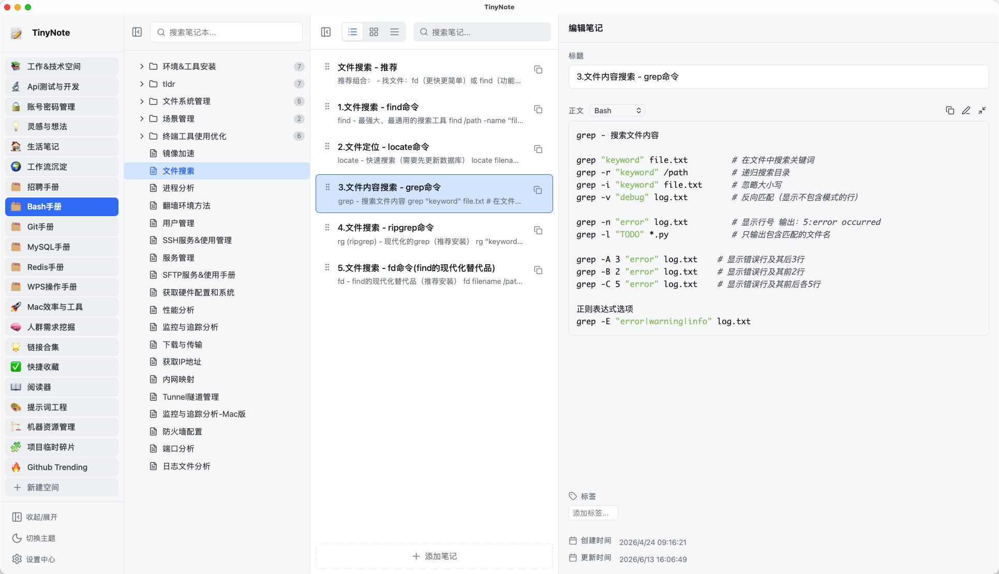
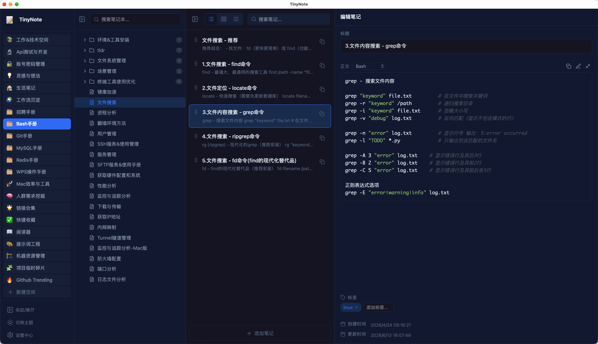

# TinyNote 轻记

**为开发者和效率用户打造的本地优先笔记工具。保存命令、Prompt、配置、代码片段和知识卡片，需要时一键复制。**

TinyNote 轻记不是又一个臃肿的长文档笔记软件。它从「零碎内容的高频取用」出发，把 Shell 命令、JSON 配置、SQL 片段、Prompt 模板、账号备忘、排障记录和知识卡片整理得清清楚楚，找到即复制。

[English](README.md) · 简体中文

[](https://github.com/wu2kong/tinynote-app/releases/latest)
[](https://github.com/wu2kong/tinynote-app/releases)
[](LICENSE)
[](https://tauri.app/)

[官网](https://tinynote.wu2kong.com/) · [下载](https://github.com/wu2kong/tinynote-app/releases/latest) · [帮助文档](https://tinynote.wu2kong.com/docs/app) · [反馈问题](https://github.com/wu2kong/tinynote-app/issues)

## 为什么选择 TinyNote

很多笔记软件适合写长文档，TinyNote 更适合管理每天反复取用的短内容。

| 特性 | 说明 |
| --- | --- |
| 5-10 MB 轻量安装包 | 基于 Tauri 构建，下载快、启动快、占用少 |
| 一键复制 | 笔记块可单独复制标题、正文或完整内容，无需鼠标框选 |
| 本地优先 | 笔记保存在本地 Markdown 文件中，隐私可控、格式开放 |
| 快速检索 | 支持目录与笔记内容搜索，快速定位片段 |
| Git 同步 | 支持 GitHub、GitLab、Gitee、Codeup、AtomGit 和 TinyNote 官方 Git |
| 跨平台 | 当前支持 macOS、Windows、Linux |

TinyNote 不止是块笔记工具。它会继续向「专注笔记与个人知识管理效率」演进，让记录、整理、检索、同步、复用都保持轻快。

## 界面预览





## 适合场景

- Shell 命令手册、终端片段、运维命令
- API 示例、JSON 配置、SQL 片段、代码模板
- AI Prompt 模板和常用工作流
- 排障记录、服务器操作备忘、检查清单
- 每天反复复制、不想从长文档里重新框选的内容
- 个人知识卡片、资料索引、灵感收集

## 当前功能

- **块笔记本**：每条内容都是独立笔记块，带独立复制按钮。
- **Markdown 笔记**：直接创建和编辑 Markdown 文件。
- **文章笔记**：适合更长内容的专注写作模式。
- **层级组织**：空间、分组、笔记本、笔记块，多层结构管理内容。
- **拖拽排序**：支持空间、分组、笔记本、笔记块排序。
- **本地备份**：一键导出工作区备份。
- **Git 同步**：把笔记库作为 Git 仓库进行同步。
- **AI 问答**：支持接入 OpenAI 兼容模型，密钥保存在本机。
- **多主题**：内置浅色、暗色、纸张、抹茶、日落等主题。
- **多语言**：支持简体中文、繁體中文、English、日本語、한국어、Deutsch、Français、Italiano、Русский。

## 下载

TinyNote 免费下载，无需注册账号即可使用。

- [GitHub Releases](https://github.com/wu2kong/tinynote-app/releases/latest)
- [国内蓝奏云镜像](https://www.ilanzou.com/s/B6uXlvhu)

当前支持平台：

| 平台 | 安装包 |
| --- | --- |
| macOS | `.dmg`、`.app.tar.gz` |
| Windows | `.exe`、`.msi` |
| Linux | `.deb`、`.rpm`、`.AppImage` |

后续计划上架：

- Mac App Store
- Microsoft Store
- iOS
- Android

## 后续规划

- 上架 Mac App Store 和 Microsoft Store
- 推出 iOS 与 Android 版本
- 支持 iCloud、Dropbox 等更多云盘同步方式
- 支持更多笔记格式，例如清单、脑图等
- 增强导入导出能力
- 优化键盘优先的高效操作
- 改进同步冲突处理体验
- 提供更多社区主题和官方样例库

## 开发

环境要求：

- Node.js
- npm
- Rust 与 Tauri 所需环境

安装依赖：

```bash
npm install
```

启动前端开发服务：

```bash
npm run dev
```

启动 Tauri 桌面应用：

```bash
npm run tauri dev
```

运行测试：

```bash
npm test
```

构建前端：

```bash
npm run build
```

构建桌面安装包：

```bash
npm run tauri build
```

## 文档

- 使用说明：[tinynote.wu2kong.com/docs/app](https://tinynote.wu2kong.com/docs/app)
- 文档源码：[docs-site](docs-site/README.md)

本地运行文档站：

```bash
npm run docs:dev
```

## 贡献

欢迎提交 Issue 和 Pull Request。如果不知道从哪里开始，可以先看 `good first issue`，或者提交你遇到的问题和想要的功能。

提交 PR 前建议运行：

```bash
npm test
npm run build
```

更多说明见 [CONTRIBUTING.md](CONTRIBUTING.md)。

## 作者

Made by [悟二空](https://wu2kong.com) · [GitHub](https://github.com/wu2kong)

## 许可证

TinyNote 使用 [MIT License](LICENSE) 开源。
