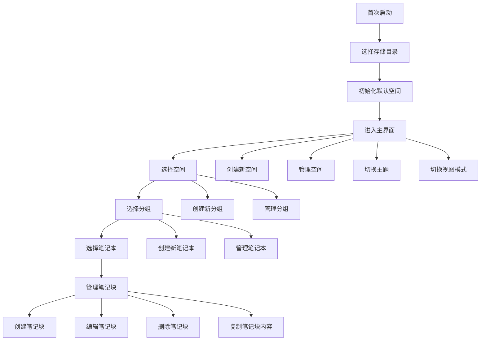

## 1. Product Overview
TinyNote 是一款轻量级快捷笔记管理 + 快捷复制工具，旨在帮助用户高效管理和复制命令、代码片段和笔记。
- 主要解决用户在开发和日常工作中需要频繁复制和管理代码片段、命令和笔记的问题
- 目标用户为开发者、IT 专业人员和需要频繁使用命令行的用户

## 2. Core Features

### 2.1 User Roles
| Role | Registration Method | Core Permissions |
|------|---------------------|------------------|
| User | 无需注册 | 管理笔记、复制内容、切换主题 |

### 2.2 Feature Module
1. **主界面**：四栏布局（应用栏、目录栏、笔记栏、属性编辑栏）
2. **空间管理**：创建、删除、切换空间
3. **分组管理**：创建、编辑、删除分组（支持无限层级）
4. **笔记本管理**：创建、编辑、删除笔记本
5. **笔记块管理**：创建、编辑、删除、拖拽排序笔记块
6. **快捷复制**：一键复制笔记块内容到剪贴板
7. **主题切换**：切换浅色/深色主题
8. **视图切换**：切换列表视图、卡片视图、紧凑视图
9. **源码模式**：直接编辑 Markdown 文件源码

### 2.3 Page Details
| Page Name | Module Name | Feature description |
|-----------|-------------|---------------------|
| 主界面 | 应用栏 | 显示应用图标和标题，列出所有空间，提供添加空间按钮，设置入口和主题切换入口 |
| 主界面 | 目录栏 | 提供搜索框，显示分组和笔记本列表（支持无限层级），显示笔记本数量统计 |
| 主界面 | 笔记栏 | 提供视图切换按钮，显示笔记块列表，每个笔记块包含标题、内容预览和复制按钮，提供新增笔记块按钮，支持拖拽排序 |
| 主界面 | 属性编辑栏 | 当点击笔记块时显示，提供标题编辑、内容编辑、标签管理和删除按钮 |
| 主界面 | 空间管理 | 支持创建新空间，删除现有空间，切换当前空间 |
| 主界面 | 分组管理 | 支持创建新分组，编辑分组名称，删除分组，支持无限层级嵌套 |
| 主界面 | 笔记本管理 | 支持创建新笔记本，编辑笔记本名称，删除笔记本，切换源码模式 |
| 主界面 | 笔记块管理 | 支持创建新笔记块，编辑笔记块内容，删除笔记块，拖拽排序笔记块 |
| 主界面 | 快捷复制 | 点击复制按钮将笔记块内容复制到剪贴板，显示复制成功提示 |
| 主界面 | 主题切换 | 支持手动切换浅色/深色主题，记忆用户偏好设置 |
| 主界面 | 视图切换 | 支持切换列表视图、卡片视图、紧凑视图，记忆用户偏好设置 |

## 3. Core Process

### 3.1 Main User Flows
1. **首次启动流程**：
   - 用户选择存储目录
   - 应用初始化，创建默认空间
   - 进入主界面

2. **笔记管理流程**：
   - 用户选择或创建空间
   - 用户选择或创建分组
   - 用户选择或创建笔记本
   - 用户在笔记本中创建、编辑、删除笔记块
   - 用户点击复制按钮复制笔记块内容

3. **空间和分组管理流程**：
   - 用户创建新空间
   - 用户在空间中创建分组和子分组
   - 用户在分组中创建笔记本
   - 用户管理空间、分组和笔记本（重命名、删除）

### 3.2 Flowchart

## 4. User Interface Design
### 4.1 Design Style
暂定

### 4.2 Page Design Overview
| Page Name | Module Name | UI Elements |
|-----------|-------------|-------------|
| 主界面 | 应用栏 | 极窄侧边栏，背景色浅灰/深灰，空间列表垂直排列，添加空间按钮在空间列表下方，设置和主题切换入口在底部 |
| 主界面 | 目录栏 | 固定宽度 250px，顶部搜索框，分组和笔记本列表支持折叠/展开，笔记本数量显示在分组右侧，支持右键菜单 |
| 主界面 | 笔记栏 | 弹性宽度，顶部视图切换按钮，笔记块列表垂直排列，每个笔记块包含标题、内容预览和复制按钮，支持拖拽排序，新增笔记块按钮在底部 |
| 主界面 | 属性编辑栏 | 弹性宽度，显示当前选中笔记块的详细信息，包含标题输入框、内容编辑器、标签管理和删除按钮 |

### 4.3 Responsiveness
- **设计理念**：桌面优先设计，针对桌面端优化
- **响应式策略**：在小屏幕设备上，四栏布局会自动调整为三栏或两栏布局，优先保留笔记栏和属性编辑栏
- **触摸优化**：支持触摸操作，按钮和可交互元素尺寸适合触摸

### 4.4 3D Scene Guidance
- 无 3D 场景需求