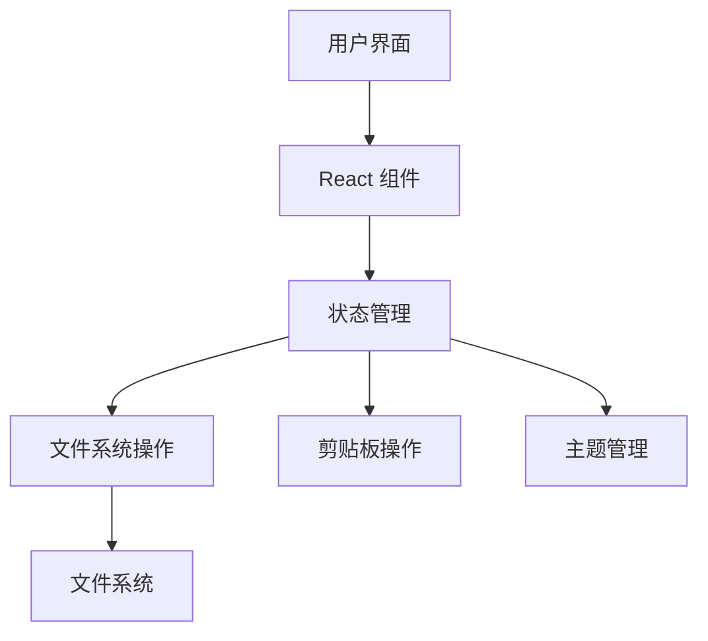
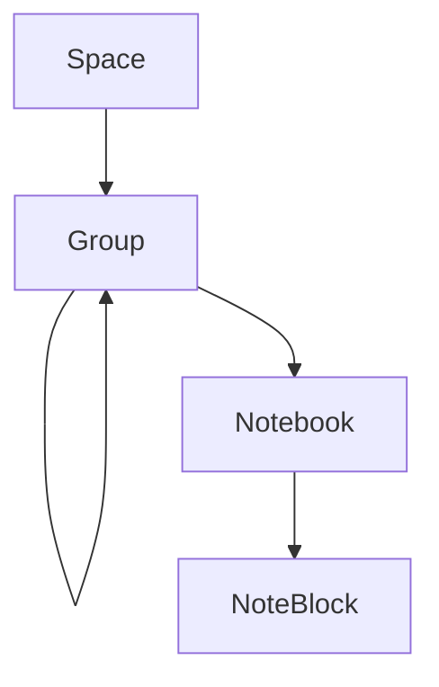

## 1. Architecture Design



### 1.1 架构层次
- **用户界面层**：React 组件，负责渲染 UI 和处理用户交互
- **文件系统操作层**：Tauri fs API，处理文件和目录的读写操作
- **文件系统**：存储笔记文件和目录结构
- **剪贴板操作层**：Tauri clipboard API，处理复制操作

## 2. Technology Description
- **前端框架**：React@18 + TypeScript
- **桌面应用框架**：Tauri 2.0+
- **文件操作**：Tauri fs API
- **剪贴板操作**：Tauri clipboard API
- **存储位置**：用户自定义目录，默认创建在用户选择的位置
- **构建工具**：Vite

## 3. Route Definitions
- 有应用页面
- 有设置页面

## 4. API Definitions
- 无外部 API 调用，所有操作均在本地进行

## 5. Server Architecture Diagram
- 无服务器架构，应用为纯桌面应用

## 6. Data Model

### 6.1 Data Model Definition



### 6.2 Data Structure

#### 6.2.1 笔记块 (NoteBlock)
```typescript
interface NoteBlock {
  id: string;           // 唯一标识符
  title: string;        // 标题
  content: string;      // 内容
  tags: string[];       // 标签
  createdAt: string;    // 创建时间
  updatedAt: string;    // 更新时间
}
```

#### 6.2.2 笔记本 (Notebook)
```typescript
interface Notebook {
  id: string;           // 唯一标识符
  name: string;         // 名称
  path: string;         // 文件路径
  noteBlocks: NoteBlock[]; // 笔记块列表
  isSourceMode: boolean; // 是否为源码模式
}
```

#### 6.2.3 分组 (Group)
```typescript
interface Group {
  id: string;           // 唯一标识符
  name: string;         // 名称
  path: string;         // 目录路径
  children: (Group | Notebook)[]; // 子分组和笔记本
  notebookCount: number; // 笔记本数量（递归计算）
}
```

#### 6.2.4 空间 (Space)
```typescript
interface Space {
  id: string;           // 唯一标识符
  name: string;         // 名称
  path: string;         // 目录路径（{空间名称}.tinynotes）
  groups: Group[];      // 分组列表
}
```

#### 6.2.5 应用状态 (AppState)
```typescript
interface AppState {
  spaces: Space[];      // 空间列表
  currentSpace: Space | null; // 当前空间
  currentGroup: Group | null; // 当前分组
  currentNotebook: Notebook | null; // 当前笔记本
  isDarkTheme: boolean; // 是否为深色主题
  viewMode: 'list' | 'card' | 'compact'; // 视图模式
  searchQuery: string; // 搜索查询
}
```

### 6.3 笔记文件格式

采用 Markdown 扩展格式，使用特定分隔符区分笔记块：

```markdown
---
title: 笔记块标题
tags: [tag1, tag2]
createdAt: 2026-04-17T12:00:00Z
updatedAt: 2026-04-17T12:00:00Z
---

笔记内容，可以是纯文本、JSON代码或各种语言的代码片段

---
title: 另一个笔记块标题
tags: [tag3]
createdAt: 2026-04-17T12:00:00Z
updatedAt: 2026-04-17T12:00:00Z
---

另一个笔记块的内容
```

### 6.4 存储结构

```
{用户选择的存储位置}/
  ├── 空间1.tinynotes/
  │   ├── 分组1/
  │   │   ├── 子分组1/
  │   │   │   └── 笔记本1.md
  │   │   └── 笔记本2.md
  │   └── 分组2/
  │       └── 笔记本3.md
  └── 空间2.tinynotes/
      └── 笔记本4.md
```

## 7. 技术实现要点

### 7.1 文件系统操作
- 使用 Tauri fs API 进行文件和目录的读写操作
- 实现文件系统的递归扫描，构建内存缓存
- 实现文件的读写、创建、删除操作

### 7.2 笔记块解析
- 使用正则表达式解析 Markdown 扩展格式
- 实现笔记块的序列化和反序列化
- 支持解析和生成包含元数据的笔记块

### 7.3 拖拽排序
- 使用 React DnD 库实现拖拽功能
- 实现笔记块的拖拽排序逻辑
- 优化拖拽过程中的视觉反馈

### 7.4 主题切换
- 使用 CSS Variables 实现主题变量
- 全局状态管理主题设置
- 确保所有组件使用主题变量而非硬编码颜色

### 7.5 缓存机制
- 应用启动时，扫描存储目录，构建内存缓存
- 提供重建缓存的入口，当数据损坏时使用
- 定期自动保存，确保数据持久化

### 7.6 数据同步
- 内存缓存与文件系统的双向同步
- 当检测到文件系统变化时，自动更新缓存
- 当用户修改笔记时，实时更新缓存并定期同步到文件系统

## 8. 项目结构

```
tinynote-app/
  ├── src/
  │   ├── components/
  │   │   ├── AppBar.tsx         # 应用栏组件
  │   │   ├── DirectoryPanel.tsx  # 目录栏组件
  │   │   ├── NotePanel.tsx       # 笔记栏组件
  │   │   ├── PropertyPanel.tsx   # 属性编辑栏组件
  │   │   ├── NoteBlock.tsx       # 笔记块组件
  │   │   ├── SpaceItem.tsx       # 空间项组件
  │   │   ├── GroupItem.tsx       # 分组项组件
  │   │   └── NotebookItem.tsx    # 笔记本项组件
  │   ├── context/
  │   │   └── AppContext.tsx      # 应用状态管理
  │   ├── hooks/
  │   │   ├── useFileSystem.ts    # 文件系统操作 hooks
  │   │   ├── useNoteParser.ts    # 笔记解析 hooks
  │   │   └── useTheme.ts         # 主题管理 hooks
  │   ├── utils/
  │   │   ├── fileSystem.ts       # 文件系统工具函数
  │   │   ├── noteParser.ts       # 笔记解析工具函数
  │   │   └── theme.ts            # 主题工具函数
  │   ├── types/
  │   │   └── index.ts            # 类型定义
  │   ├── App.tsx                 # 应用主组件
  │   └── main.tsx                # 应用入口
  ├── public/
  │   └── icon.png                # 应用图标
  ├── src-tauri/
  │   ├── src/
  │   │   └── main.rs             # Tauri 主文件
  │   └── Cargo.toml              # Tauri 配置
  ├── package.json                # 项目依赖
  ├── tsconfig.json               # TypeScript 配置
  ├── vite.config.ts              # Vite 配置
  └── README.md                   # 项目说明
```

## 9. 性能优化策略

1. **文件系统操作优化**：
   - 使用内存缓存减少文件系统操作
   - 批量写入和延迟写入策略
   - 异步操作避免阻塞 UI

2. **笔记块解析优化**：
   - 使用正则表达式高效解析 Markdown 扩展格式
   - 缓存解析结果，避免重复解析

3. **渲染优化**：
   - 使用 React.memo 优化组件渲染
   - 虚拟列表处理大量笔记块
   - 懒加载非关键组件

4. **状态管理优化**：
   - 使用 useReducer 管理复杂状态
   - 合理划分状态，避免不必要的重渲染

## 10. 兼容性考虑

- **跨平台兼容性**：使用 Tauri 确保在 Windows、macOS 和 Linux 上的一致性体验
- **文件系统兼容性**：处理不同操作系统的文件路径差异
- **主题兼容性**：确保在不同主题下的 UI 一致性
- **响应式兼容性**：适应不同屏幕尺寸的布局调整
